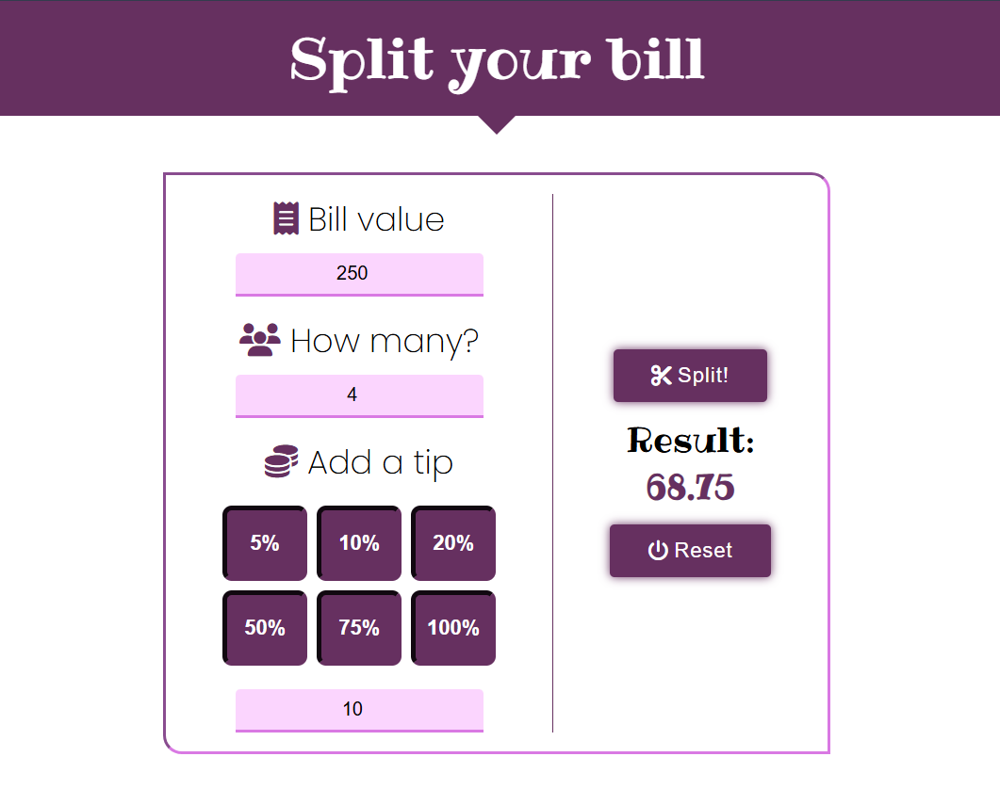

# Bill Splitter

## Description
Bill Splitter is a simple full-responsive web application that helps divide a bill among multiple people. The user enters the total bill amount, the number of people, and an optional tip, and the app calculates the amount to be paid per person.

## Features
- Enter the bill amount.
- Specify the number of people.
- Add a tip (options: 5%, 10%, 20%, 50%, 75%, 100%, or custom percentage).
- Calculate the amount to be paid per person.
- Reset values.
- Dynamic button appearance based on input data.

## Technologies
- **DOM** – Dynamic manipulation of HTML elements.
- **HTML** – Application structure.
- **CSS** – Styling the interface.
- **JavaScript** – Handling calculation logic and dynamic UI changes.

## Installation & Usage
1. Download the application files or clone the repository.
2. Open the `index.html` file in a web browser.

## How to Use?
1. Enter the bill amount in the "Bill value" field.
2. Enter the number of people in the "How many?" field.
3. Select a tip by clicking on the appropriate button or entering a custom percentage.
4. Click the **"Split!"** button to calculate the amount per person.
5. If you want to reset all values, click **"Reset"**.

## Example

